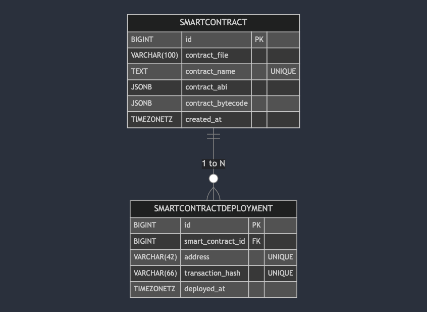

# PZIPPER Assignment
### User Interface


### Architecture


### Database Schema

<!-- ```mermaid
erDiagram
    SMARTCONTRACT {
        BIGINT id PK
        VARCHAR(100) contract_file
        TEXT contract_name "UNIQUE"
        JSONB contract_abi
        JSONB contract_bytecode
        TIMEZONETZ created_at
    }

    SMARTCONTRACTDEPLOYMENT {
        BIGINT id PK
        BIGINT smart_contract_id FK
        VARCHAR(42) address "UNIQUE"
        VARCHAR(66) transaction_hash "UNIQUE"
        TIMEZONETZ deployed_at
    }

    SMARTCONTRACT ||--o{ SMARTCONTRACTDEPLOYMENT : "1 to N"
``` -->
### How to start the services
1. `docker-compose build --no-cahce`
2. `docker-compose up`
3. `open http://localhost:8000`

### How to use backend linter and formatter
1. `docker-compose exec web bash -c 'ruff check backend --config pyproject.toml'`
2. `docker-compose exec web bash -c 'isort backend --settings pyproject.toml'`
3. `docker-compose exec web bash -c 'ruff format backend --config pyproject.toml'`

### API Documentation
* `POST /blockchain/smartcontract/`
    * **Description**: 
        * Upload a new smart contract.
    * **Query Parameters**: null  
    * **Request Body**:
        | Parameter | Type  | Required | Description                     |
        |-----------|-------|----------|---------------------------------|
        | data      | file  | Yes      | The smart contract file to upload. |

    * **Response**:
        - **201 Created**:
            ```json
            {
                "SUCCESS": true,
                "PAYLOAD": {
                    "id": 1,
                    "contract_name": "Counter",
                    "created_at": "2025-02-22T12:00:00.000000Z"
                }
            }
            ```
        - **400 Bad Request**:
            ```json
            {
                "SUCCESS": false,
                "ERR_MSG": "Missing Input Error: no file"
            }
            ```

* `GET /blockchain/smartcontract/`
    * **Description**: 
        * Retrieve all smart contracts.
    * **Query Parameters**: null  
    * **Request Body**: null  
    * **Response**:
        - **200 OK**:
            ```json
            {
                "SUCCESS": true,
                "PAYLOAD": [
                    {
                        "id": 2,
                        "contract_name": "Lock",
                        "created_at": "2025-02-22T20:00:00.000000Z"
                    },
                    {
                        "id": 1,
                        "contract_name": "Counter",
                        "created_at": "2025-02-22T12:00:00.000000Z"
                    }
                ]
            }
            ```

* `POST /blockchain/deployment/`
    * **Description**: 
        * Deploy the specific smart contract.
    * **Query Parameters**: null  
    * **Request Body**:
        | Parameter    | Type   | Required | Description                        |
        |-------------|--------|----------|------------------------------------|
        | contract_id | int    | Yes      | The ID of the smart contract.     |

    * **Response**:
        - **201 Created**:
            ```json
            {
                "contract_id": 1,
                "contract_name": "Counter",
                "address": "0xe7f1725E7734CE288F8367e1Bb143E90bb3F0512",
                "deployed_at": "2025-02-22T12:00:00.000000Z"
            }
            ```
        - **400 Bad Request**
            ```json
            {
                "SUCCESS": false,
                "ERR_MSG": "Missing Input Error: contract_id is necessary"
            }
            ```

* `GET /blockchain/deployment/`
    * **Description**: 
        * Retrieve all deployments for a specific smart contract.
    * **Query Parameters**:
        | Parameter    | Type   | Required | Description                        |
        |-------------|--------|----------|------------------------------------|
        | contract_id | int    | Yes      | The ID of the smart contract.     |
    * **Request Body**: null
    * **Response**:
        - **200 OK**:
            ```json
            {
                "SUCCESS": true,
                "PAYLOAD": [
                    {
                        "contract_id": 1,
                        "contract_name": "Counter",
                        "address": "0xDc64a140Aa3E981100a9becA4E685f962f0cF6C9",
                        "deployed_at": "2025-02-23T18:00:00.000000Z"
                    },
                    {
                        "contract_id": 1,
                        "contract_name": "Counter",
                        "address": "0xe7f1725E7734CE288F8367e1Bb143E90bb3F0512",
                        "deployed_at": "2025-02-22T12:00:00.000000Z"
                    }
                ]
            }
            ```
        - **400 Bad Request**
            ```json
            {
                "SUCCESS": false,
                "ERR_MSG": "Missing Input Error: contract_id is necessary"
            }
            ```

* `POST /blockchain/smartcontract-counter/increase-count/`
    * **Description**: 
        * Call the `increment` function of the latest deployment of the `Counter` smart contract.
    * **Query Parameters**: null  
    * **Request Body**: null  
    * **Response**:
        - **200 OK**:
            ```json
            {
                "SUCCESS": true,
                "PAYLOAD": null
            }
            ```

* `GET /blockchain/smartcontract-counter/get-count/`
    * **Description**: 
        * Retrieve the `count` attribute of the latest deployment of the `Counter` smart contract.
    * **Query Parameters**: null  
    * **Request Body**: null  
    * **Response**:
        - **200 OK**:
            ```json
            {
                "SUCCESS": true,
                "PAYLOAD":{
                    "current_count": 5
                }
            }
            ```

* `GET /blockchain/ping-hardhat/`
    * **Description**: 
        * Check if the `Hardhat` server is running and ready to accept requests.
    * **Query Parameters**: null  
    * **Request Body**: null
    * **Response**:
        - **200 OK**:
            ```json
            {
                "SUCCESS": true,
                "PAYLOAD": null
            }
            ```